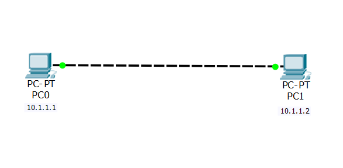

# Lab 6.1  Illustration Images
Click on each image to view it in full size.

---

## Network Topology

_This image shows the overall network topology created for experiment 6.1, illustrating the connection between 2 PCs connected through Copper cross over wire._

---

## PC-0 Configuration

_Configuration settings of PC0 including IP address and subnet mask._

---

## PC-1 Configuration

_Configuration settings of PC1 including IP address and subnet mask._

---

## PDU (Protocol Data Unit) Details

_This image captures the PDU details during the ping test from PC0 to PC1, showing the ICMP echo request and reply._

---

[Back to Index](../README.md)

## Ping Test

_Result of the ping test from PC0 to PC1, demonstrating successful communication within the same subnet._

---

    <a href="../README.md" style="text-decoration: none; color: #0366d6; font-weight: bold;">⬅️ Back to Index</a>

